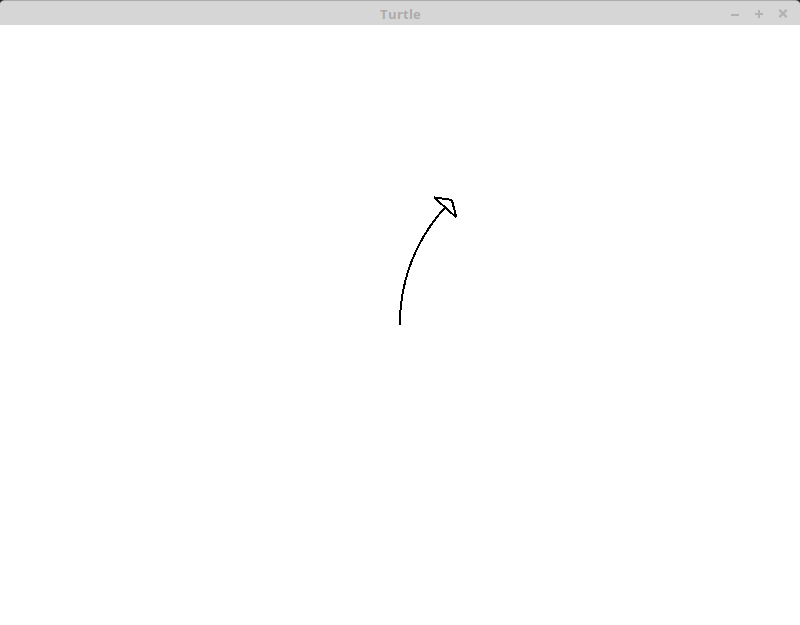

# turtle

Turtle graphics in [Rust][rust]. This library is a tool for teaching programming
by drawing pictures. Learning this way is both fun and interesting for students
of all ages!

**The idea:** You control a turtle with a pen tied to its tail. As it moves
across the screen, it draws the path that it follows. You can use this to draw
any picture you want just by moving the turtle across the screen.


## Example

As a simple example, you can draw a circle with only the following code:

```rust
extern crate turtle;

use turtle::Turtle;

fn main() {
    let mut turtle = Turtle::new();

    for _ in 0..360 {
        // Move forward three steps
        turtle.forward(3.0);
        // Rotate to the right (clockwise) by 1 degree
        turtle.right(1.0);
    }
}
```

This will produce the following:



See the [`examples/`](./examples) directory for more examples of how to use this
library.

## Inspiration

This is inspired by the [Logo educational programming language][logo-lang] and
is featured in many programming languages. For example, [Python][python] comes
with a [built-in turtle module][turtle-py]. This library is based on that
module, but uses Rust conventions and best practices to accomplish the same
goals.

[rust]: https://www.rust-lang.org/
[logo-lang]: https://en.wikipedia.org/wiki/Logo_(programming_language)
[python]: https://www.python.org/
[turtle-py]: https://docs.python.org/2/library/turtle.html
